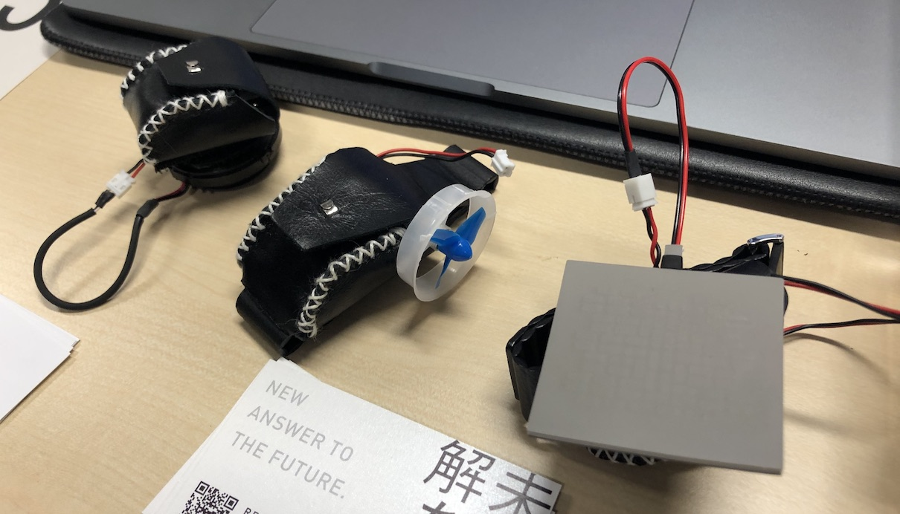
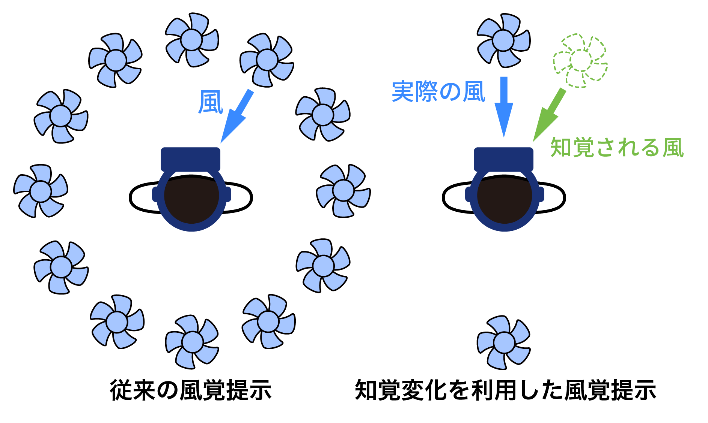

この記事は、[Haptics Advent Calendar 2019](https://adventar.org/calendars/4151) 7日目の記事です。
明日はぐーぺんさんです。

#### はじめに
kn1chtと申します。東大柏キャンパスにある[割澤・福井・米谷研究室](http://www.lhei.k.u-tokyo.ac.jp/)で**風ディスプレイ**の研究をしている修士1年です。
9月に参加した[第24回日本バーチャルリアリティ学会大会](http://conference.vrsj.org/ac2019/)を実況ツイートしていたら、このツイートが188RT（2019年12月3日現在）とそこそこ伸びました。

<blockquote class="twitter-tweet" data-partner="tweetdeck">
VRでの歩行中にちゃんと進行方向から風を当てるとVR酔いが軽減される <a href="https://twitter.com/hashtag/VR%E5%AD%A6%E4%BC%9A?src=hash&amp;ref_src=twsrc%5Etfw">#VR学会</a> <a href="https://t.co/ZgjZTYYxzM">pic.twitter.com/ZgjZTYYxzM</a>
&mdash; kn1cht (@kn1cht) <a href="https://twitter.com/kn1cht/status/1171625590522298369?ref_src=twsrc%5Etfw">September 11, 2019</a></blockquote>

（このツイートの文面は少し間違っていて、[論文](http://conference.vrsj.org/ac2019/program/common/doc/pdf/4B-07.pdf)によれば**風を当てる方向によらずVR酔い軽減の効果があった**そうです）

VR好きの方々にかなり広まったこのツイートですが、面白かったのが皆さんの反応でした。
もともと自室でのVRで酔い対策に扇風機を使っているという方や、ロケーションベースVRで風があり酔いにくかったという方がそれなりにおられたのです。
VR学会大会の期間中には東京ゲームショウ2019も開催されており、ホウキに乗って飛ぶ体験ができる「[リトルウィッチアカデミアVR](https://lwa-vr.com/jp/)」にて**酔い対策の一環で風が使われていた**というツイートもありました。

<blockquote class="twitter-tweet">
リトルウィッチアカデミアVRで3次元的に動く乗り物なのに全く酔いが無かったんだけど  風を画面で表示するのとか、実際に当てるのとかって工夫もしたそう<a href="https://twitter.com/hashtag/%E3%83%AA%E3%83%88%E3%83%AB%E3%82%A6%E3%82%A3%E3%83%83%E3%83%81%E3%82%A2%E3%82%AB%E3%83%87%E3%83%9F%E3%82%A2?src=hash&amp;ref_src=twsrc%5Etfw">#リトルウィッチアカデミア</a> <a href="https://twitter.com/hashtag/TGS2019?src=hash&amp;ref_src=twsrc%5Etfw">#TGS2019</a> <a href="https://t.co/Rysuga7mDP">https://t.co/Rysuga7mDP</a>
&mdash; atsu_c (@atsudr_2) <a href="https://twitter.com/atsudr_2/status/1172097010503077888?ref_src=twsrc%5Etfw">September 12, 2019</a></blockquote> 

筆者自身はあまりロケーションベースVRに行かないのですが、移動するタイプのコンテンツを中心に、風の刺激を取り入れるケースはかなり増えてきているようです。

VRで風を当てるという提示は、広い意味での触覚提示の1つだと言えます。
風が皮膚に当たると、触覚や温冷覚が生じます。これらの風によって生じる皮膚感覚をまとめて「**風覚**」と読んでいる研究者もいます。
研究の世界では、風覚を再現するための装置として様々な「**風覚ディスプレイ**」が提案されています。

筆者は学部4年の卒論から風覚ディスプレイの研究を行っており、今年7月に行われた2019 IEEE World Haptics Conference (WHC) でその成果を[発表しました](https://ieeexplore.ieee.org/abstract/document/8816111)。
本記事では、触刺激としての風の利用方法や、最新の動向について概要をまとめます。
研究に携わる方だけでなく、VRコンテンツを作る側の人にも風を利用する際の参考にしていただければ幸いです。

#### 風を利用した触覚提示
風を使った触覚ディスプレイは、風を直接皮膚に当てるものと、風によって生じる力を間接的に利用するものに分かれます。
後者には稲見研の[LevioPole](https://star.rcast.u-tokyo.ac.jp/leviopole/)やKAISTの[Aero-plane](http://makinteract.kaist.ac.kr/project/aeroplane-2019)などがあり、**プロペラの推力で重量感・抵抗感を再現**することがメインです。
本記事のメインである風覚を主眼に置いたものではないため、これらを深く取り上げることはしません。

- [プロペラを使用した触覚研究4本 | Seamless](https://shiropen.com/seamless/vr/propeller)
- 
- 

#### 風覚提示の用途
##### 臨場感・没入感の増強
風覚の利用はVRの最初期から行われており、最初の多感覚VRと呼ばれるMorton L Heiligの[Sensorama](https://patents.google.com/patent/US3050870A/en)（1962年）でも刺激の1つに風が使われています。
Sensoramaのように、多感覚の刺激を同時に与えて臨場感・没入感を高めることは現在でも広く行われています。
特に、映画館では4DX・MX4Dといった多数の刺激を組み合わせる上映方式が定着しています。

臨場感を高めるために風を利用できる場面はいくつかあります。

1. 乗り物などで移動する場面（自動車・船・飛行機・自分が鳥になるなど）
1. 物体が飛んできたり、爆発したりする場面
1. 屋外の天候・気候を再現する場面

1番目は、**移動している方向から風を当てて移動感を増強する**ものです。
レースなど爽快感が必要なコンテンツなら特に、風があるだけで体験の質が大幅に向上するでしょう。
全身で鳥になった感覚を味わえるマシン「[Birdly](https://birdly.com/)」でも、大型のファンから風をフィードバックするようになっています。

2番目は、**VR中の物体やエネルギーの存在を風で表現する**というものです。
例えば2009年に発表された「頭部搭載型風ディスプレイ（[PDF](http://www.interaction-ipsj.org/archives/paper2009/interactive/0121/0121.pdf)）」では、飛んでくる物体を避けると耳に風を感じるというコンセプトが提案されています。
先月決勝が行われた[IVRC2019](http://ivrc.net/2019/)で総合優勝した[VR消防体験 -炎舞-](http://ivrc.net/archive/vr%E6%B6%88%E9%98%B2%E4%BD%93%E9%A8%93-%E7%82%8E%E8%88%9E-2019/)では、前方で**爆発が起こると同時に顔へ熱風が吹き付ける**ようになっていました。
筆者がVR学会大会での予選で体験したところ、ただ映像を見ている状態と熱風がある状態とでは、爆発の迫力がまるっきり異なりました。

3番目は、**体験者が置かれた現実とは異なる天候・気候を再現する**ものです。
例えば、常温の部屋で雪山の映像と音だけを提示されても没入感は今ひとつでしょう。
温度や湿度など他の感覚を組み合わせた方が効果は高いですが、周囲から風が吹いてくるだけでも屋外にいる印象は増すと考えられます。
シンガポール国立大学のNimesha Ranasingheらは、HMDに取り付けた**2つのファンとペルチェ素子**で風覚と温度感覚を同時に提示する[Ambiotherm](https://dl.acm.org/citation.cfm?id=3025723)を提案しました。
また、国立台湾大学のPing-Hsuan Hanらは熱風・常温の風・ヒートランプ・ミストをユーザの頭上から提示する[Hapmosphere](https://ieeexplore.ieee.org/document/8816140/)を発表しました。

##### 気流による情報提示・ストレス軽減
風そのものによって何らかの情報を提示しようという試みもあります。
KAISTのJaeyeon Leeらによる[Wind Tactor](https://hcil.kaist.ac.kr/?page_id=1884)は、非接触で刺激を与えられる風の特徴を生かして、**不快感を生じさせずに情報を伝える**装置です。
首や手首などに数cm離した複数のノズルから風を当てて、ユーザが異なる配置のノズルからの気流を判別できることが確かめられました。

情報提示とは少しずれますが、九州大学の[上岡研究室](https://ryoko-ueoka.tumblr.com/)からは[頬に風を当てることでオ**フィスワークの快適さを向上させる**という研究](https://dl.acm.org/citation.cfm?doid=3025453.3025501)が2017年のCHIで発表されました。
認知タスク中に強めの風を当てると、ストレスの上昇が抑えられタスクパフォーマンスも向上することなどが示されています。
単純な情報提示に比べて評価が難しそうな分野ではありますが、今後風を使って精神的ストレスや情動に働きかける手法が発展していくかもしれません。

#### 風覚提示の手法（風覚ディスプレイ）
物に触れた時の触感を再現するには、振動・電気・超音波など様々な方法が登場しています。
一方で、風が当たる感覚の再現には、ほとんどの場合**実際に送風する**ことがほとんどです。
物理的に風を発生させることは、ファンを回転させる・ノズルから空気を吹き出すなどの方法で簡単に実現できるためです。

提案されている風覚ディスプレイ全てを取り上げると研究紹介だけで記事が埋まってしまうので、ここでは一部のみをご紹介します。

##### 周囲に設置するタイプ
ファンやノズルのような風発生源（風源）をユーザの周囲に配置する方法です。
ユーザの全身に対して様々な方向から風を当てるため、**多数の風源を搭載**するものが多いです。
しかし、装置自体が大型になるほか、**ユーザの位置や姿勢が制限される**こともあります。

最新のものでは、[WindyWall](https://dl.acm.org/citation.cfm?id=3295624)があります。
これは風の刺激を設計・研究するためのプラットフォームとされており、3枚のパネルに取り付けた合計90個ものファンを個別に制御できます。
これらのパネルはそれぞれ自由に配置でき、多様な体験設計で使えるようになっています。

装置自体が動くことで歩き回るユーザに対応したものもあります。
前項でご紹介した[Hapmosphere](https://ieeexplore.ieee.org/document/8816140/)は、天井から吊り下げた装置全体が回転するようになっています。
半径1 mほどの範囲であれば、ユーザの位置を狙って風や温度の刺激を出すことができます。

##### 頭部に搭載するタイプ
HMDの普及と合わせて、**風覚ディスプレイ自体を頭に載せてしまう**というアイデアが出てきました。
設置型と違って、ユーザの動きを制限することがありません。
研究の事例として[VaiR](https://dl.acm.org/citation.cfm?id=3025453.3026009)をご紹介します。
2本の弓形のフレームに5個ずつノズルを取り付けた機構になっており、それぞれのノズルから風を吹き出して風向を表現できます。
また、弓形フレームはそれぞれが回転するので、真上や真後ろからも風を当てることができます。

##### 頭部以外に搭載するタイプ
頭部以外に装着して風を当てるタイプの装置も登場しています。前項で挙げた[Wind Tactor](https://hcil.kaist.ac.kr/?page_id=1884)では、腕に装着することも想定されています。
また、今年のSIGGRAPH Asia Emerging Technologiesで発表された[Haptiple](https://dl.acm.org/citation.cfm?id=3360519)は、無線化されたモジュール式の提示装置（振動・圧力・風・温度）を自由な場所へ取り付けられるようになっています。

第24回日本バーチャルリアリティ学会大会にて筆者撮影。中央が風のモジュール

#### 風の知覚に対するアプローチ
ここまでご紹介してきた風覚ディスプレイの多くは、**風の方向を表現するために多数の風源を搭載**しています。
しかし、風源が多ければ多いほど、装置は大型で複雑なものになってしまいます。
どのように風源を配置するかを決めるには、**人の風向に対する知覚の解明**が必要です。

名城大学の中野先生は、[人間の風向知覚特性の研究](http://vrlab.meijo-u.ac.jp/research/WindDirection/index-j.html)で、頭部で区別できる最小の風向差（丁度可知差異、JND）を測定しました。
[IEEE VRでの最新の発表](http://ieeexplore.ieee.org/document/7892260/)によれば、局所的な風に対するJNDは**頭部前面・背面で4°程度、側面で11°程度です**。
風の当たる範囲をより広げた風では、頭部前面・背面のJNDがより大きくなり、風向が区別しにくくなることも分かりました。

この結果だけを見ると風源をかなり狭い間隔で置く必要がありそうですが、現実にはそうとは限りません。
[東京工科大学羽田研究室](https://www.aed-lab.net/)の斉藤らは、[ヘッドマウントディスプレイを装着した状態での風向知覚特性の測定](https://ipsj.ixsq.nii.ac.jp/ej/?action=pages_view_main&active_action=repository_view_main_item_detail&item_id=183478&item_no=1&page_id=13&block_id=8)で多間隔刺激の風向知覚への影響を指摘しました。
この研究では、HMDを装着した状態で風向を示すような映像と音を視聴させ、極限法で風向のJNDを測定しました。
結果は頭部前面で49°、側面で61°、背面で60°と、HMDで視聴覚刺激を受けた時は**大幅に風向知覚が鈍くなる**ことを示すものでした。

こうした結果から、**多感覚刺激によって風の知覚を変化させる**手法が提案され始めています。
視覚と触覚・聴覚と触覚のように、異なる種類の感覚刺激が影響しあって起こる錯覚を**クロスモーダル効果**と言います。
クロスモーダル効果を使って実際の現象とは違う知覚を生み出す方法は、既にVRの世界で活用され始めています。
風向の知覚をうまく変化させれば、**少ない風源で多様な風向を感じられる風覚ディスプレイ**が実現するのではないでしょうか。

風向知覚の変化を取り入れた風覚ディスプレイのイメージ

羽田研究室の伊藤らは、[VR空間で全周囲から風を感じる為の送風機の配置の検討](https://ipsj.ixsq.nii.ac.jp/ej/?action=pages_view_main&active_action=repository_view_main_item_detail&item_id=194008&item_no=1&page_id=13&block_id=8)で、**視聴覚から風向の情報を与えた場合の風向知覚の変化**を検証しました。
斜めに設置した4台のファンだけで、正面や真横のようにファンがない方向からも風が来るように錯覚させることができたとしています。

筆者らは、**聴覚と触覚のクロスモーダル効果で風向知覚を操作**できるのではと考え、前後に配置した2台のファンと風のバイノーラル音源（音の方向を立体的に感じられる音源）を組み合わせて実験しました。バイノーラル音源は、リアルな風の音として聞こえるように実際のファンの風を**ダミーヘッド**に当てて録音したものです。
結果は、実際のファンとは違う方向の風の音を聴かせることで、**知覚される風向が最大67°程度変化する**というものでした。
学会などで行ったデモ展示でも、ほとんどの人に風向の錯覚を実感していただけました。

風の知覚を変化させるという考え方は、今年に入って提案され始めたもので、まだまだ最適なやり方が解明されていません。
とはいえ、物理的な風を完全に再現しなくても、多様な風を感じる提示が可能なことは確かだと言えます。
知覚の操作を取り入れて風覚ディスプレイのハードウェアを簡略化できれば、VRコンテンツに風を導入することがより簡単になることでしょう。

#### おわりに
単なる退屈な研究紹介にならないよう、複数の観点から風覚ディスプレイ研究の動向をまとめてみました。
VRにおいて風がどのように利用できるのか、大まかにでもご理解いただけましたら幸いです。

ここで挙げた研究では大掛かりな装置を使うものが多いとはいえ、数個のファンの風量を制御して風を当てるだけならそれほど大変な実装ではありません。
これからVR作品を作る皆さまは、風を取り入れて臨場感・没入感を高められないか、ぜひ考えてみてください！

#### 参考文献
